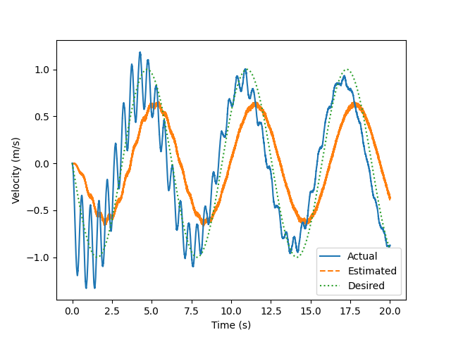

# ObserverDesign

## Install
Recommend using a venv with python 3.8. Run:
```
pip install --upgrade pip
pip install -r requirements.txt
```

To learn more about drake, check out the documentation [here](https://drake.mit.edu/pydrake/index.html)

## Run

### Example 1: Double Integrator

Our first example is a double integrator with torque input and position sensing and a PD controller. The goal is to design an observer that is robust to sensor noise. 

We start with a naive observer that uses the raw sensor signal for position and a finite difference for velocity. You can simulate the resulting system by running:
```
python DoubleIntegrator.py
```

With no noise, it tracks fine, however, if we add 0.01cm std of sensor noise it starts to track poorly:

```
python DoubleIntegrator.py -sensor_noise 0.01
```

#### Example 1.1 (see tag: Example_1_1)
Your goal is to implement the class DIKalmanObserver in DoubleIntegrator.py using a Kalman filter. See [this doc](https://www.cs.unc.edu/~welch/media/pdf/kalman_intro.pdf) for a good intro.

As a side goal, take a look through the code to get a feel for how the system is structured in Drake. In particular, look at the methods and properties of the MultiBodyPlant object created by BuildDIPlant. You can use these to calculate many useful values, including jacobians, gravity and cotiolis forces and relative frame positions. For the double integrator we don't need all of this, but it will be more useful as we move onto more complicated examples.

#### Example 1.2 (see tag: Example 1_2)
With the basic filter implemented in Example 1.1, the velocity estimation shows oscillations as well as a notable time lag. 



This is because the dynamics we are using in the filter are not the true dynamics! They are missing the contirbution from the actuation torque. The goal for this example is to add the actuation contribution to your filter implementation.
