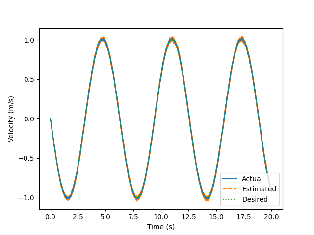
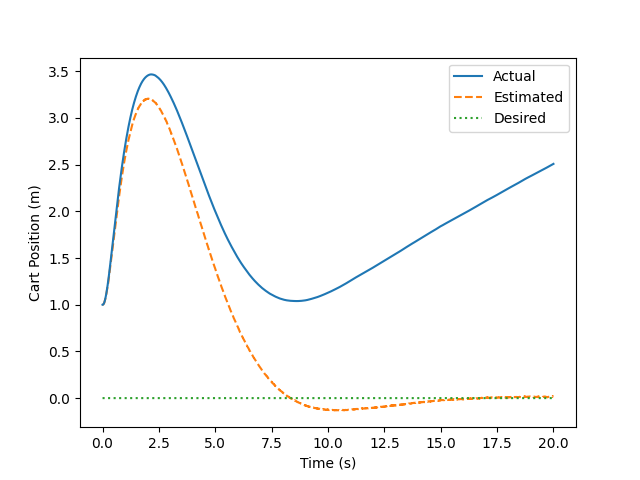
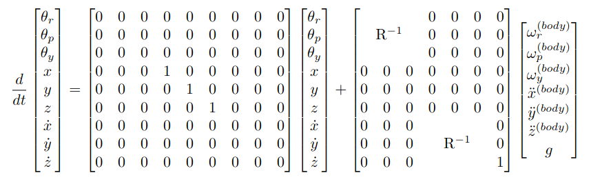

# ObserverDesign

## Install
Recommend using a venv with python 3.8. Run:
```
pip install --upgrade pip
pip install -r requirements.txt
```

To learn more about drake, check out the documentation [here](https://drake.mit.edu/pydrake/index.html)

## Run

### Example 1: Double Integrator

Our first example is a double integrator with torque input and position sensing and a PD controller. The goal is to design an observer that is robust to sensor noise. 

We start with a naive observer that uses the raw sensor signal for position and a finite difference for velocity. You can simulate the resulting system by running:
```
python DoubleIntegrator.py
```

With no noise, it tracks fine, however, if we add 0.01cm std of sensor noise it starts to track poorly:

```
python DoubleIntegrator.py -sensor_noise 0.01
```

#### Example 1.1 (see branch: Example_1_1)
Your goal is to implement the class DIKalmanObserver in DoubleIntegrator.py using a Kalman filter. See [this doc](https://www.cs.unc.edu/~welch/media/pdf/kalman_intro.pdf) for a good intro.

As a side goal, take a look through the code to get a feel for how the system is structured in Drake. In particular, look at the methods and properties of the MultiBodyPlant object created by BuildDIPlant. You can use these to calculate many useful values, including jacobians, gravity and cotiolis forces and relative frame positions. For the double integrator we don't need all of this, but it will be more useful as we move onto more complicated examples.

#### Example 1.2 (see branch: Example_1_2)
With the basic filter implemented in Example 1.1, the velocity estimate shows a notable time lag. This in turn triggers oscillations in the velocity tracking of the system


This is because the dynamics we are using in the filter are not the true dynamics! They are missing the contribution from the actuation torque. The goal for this example is to add the actuation contribution to your filter implementation.

#### Example 1.3 (see branch: Example_1_3)
Adding the actuation input to the model allows us to track the velocity nicely under sensor noise:



However, our observers don't always have access to the torques applied to the system. If actuation isn't available, a common approach is to use an IMU to measure the accelerations directly. The goal of this example is to update DIKalmanObserverWithAcceleration to include the acceleration measurement from an IMU. Make sure to also include the sensor noise from the IMU in your update!

Hint: See Example_1_3_Derivation.pdf for the trick needed to include acceleration measurements.

### Example 2: Cartpole

Our second example is a [cartpole system](http://underactuated.mit.edu/acrobot.html#cart_pole).


In our example (CartPole.py), we have set up the system with a position sensor on the pole and an accelerometer on the cart. To control the system, we use a linearization of the system around the [0,pi] position (pole pointed up) to derive a [linear quadratic regulator](http://underactuated.mit.edu/lqr.html) feedback controller. To see the behavior of the controller under perfect state estimation, run:
```
python CartPole.py -cheater_observer True
```

##### Example 2.1 (see branch: Example_2_1)

For this example, we now need to use the position sensor and accelerometer to estimate the 2 positions and velocities of the cartpole system. Your goal is to update CPKalmanObserver to build a Kalman observer linearized around the operating point of the system ([0,pi]). For an example of how to linearize the system, look at CPLQRController. If you are succesful, you should be able to run:
```
python CartPole.py
```

##### Example 2.2

After succesfully implementing the example from 2.1, we notice that the pole position and velocity converge nicely to 0, but the cart position and velocity do not:



Notice that the estimated position and velocity are driven to 0, but the actual position drifts to inifinity!

This is due to a fundamental limitation of our plant and sensor setup, namely that the cart position and cart velocity are not [observable states](https://en.wikipedia.org/wiki/Observability). A good exercise here is to use the definition of observability from the linked wikipedia page to derive the unobservable subspace for the linearized cartpole dynamics with IMU observer, and to show that this corresponds to the position and velocity of the cart. 

### Example 3: Quadrotor

Our third example is a quadrotor. Our goal with this example is to get comfortable with 3D rotations, and to start playing with the InEKF ideas in a simple framework.

The system dynamics consist of a 3D rigid body with inertia and mass that is being acted on by 4 propellers. Each propeller applies a force in the body-frame Z-axis as well as a moment around the body-frame Z-axis. The state vector ([q_w, q_x, q_y, q_z, x, y, z, wx, wy, wz, vx, vy, vz]) consists of the orientation, position, angular velocity, and linear velocity of the quadrotor (all expressed in world frame). Note that the orientation is represented as a quaternion ([q_w, q_x, q_y, q_z]), this is a generalization of complex numbers to 4D and is the most computationally efficient way to work with 3D rotations. For a brief introduction to quaternions see [this presentation](https://ethz.ch/content/dam/ethz/special-interest/mavt/robotics-n-intelligent-systems/asl-dam/documents/lectures/robot_dynamics/RD2_Quaternions.pdf), note that their [q_0, q_1, q_2, q_3] correspond to our [q_w, q_x, q_y, q_z] in sequential order.

The sensing on board is a traditional IMU setup, consisting of a body-frame measurement of the angular velocity and acceleration (including g).

The controller for this example is an LQR controller that drives rotation error and position error to 0. The gains for this LQR controller are based on a linearization around the upright hovering position. The form of the state feedback is slightly more complicated than our previous examples. The key difference is that we need to compute a difference in spatial rotations to determine the position error. The way we do this is to convert the target and actual positions to rotation matrices, use a matrix inverse and multiply to compute the difference in rotation, then convert this difference to angle axis representation. The result is a controller that converges globally (provided the state feedback is accurate).

To run example 3 with a cheater observer, call 
```
python Quadrotor.py -cheater_observer True
```

##### Example 3.1 (see branch: Example_3_1)

Your goal in example 3.1 is to implement an observer that can estimate the full robot state [q_w, q_x, q_y, q_z, x, y, z, wx, wy, wz, vx, vy, vz] based on the measurements from the IMU. To do this, you will first implement an EKF which linearizes about the current state estimate. 

The dynamics you will use for this observer are an abstraction of the true system dynamics, since we don't have measurements of the rotor forces. They are given as follows:



Here the state is in world frame coordinates and the inputs (aside from g) are in body frame (as measured). R is the rotation matrix produced by the estimated quadrotor roll pitch and yaw (you will treat this as a constant when linearizing the dynamics). 

##### Example 3.2

Once you have the EKF working from the previous example, try to initialize the estimate with a value that is far from the true value and see how that affects system stability. The problems this causes is what motivates our use of an InEKF. The goal in this example is to implement the InEKF as described in [this paper](https://www.annualreviews.org/doi/full/10.1146/annurev-control-060117-105010)
